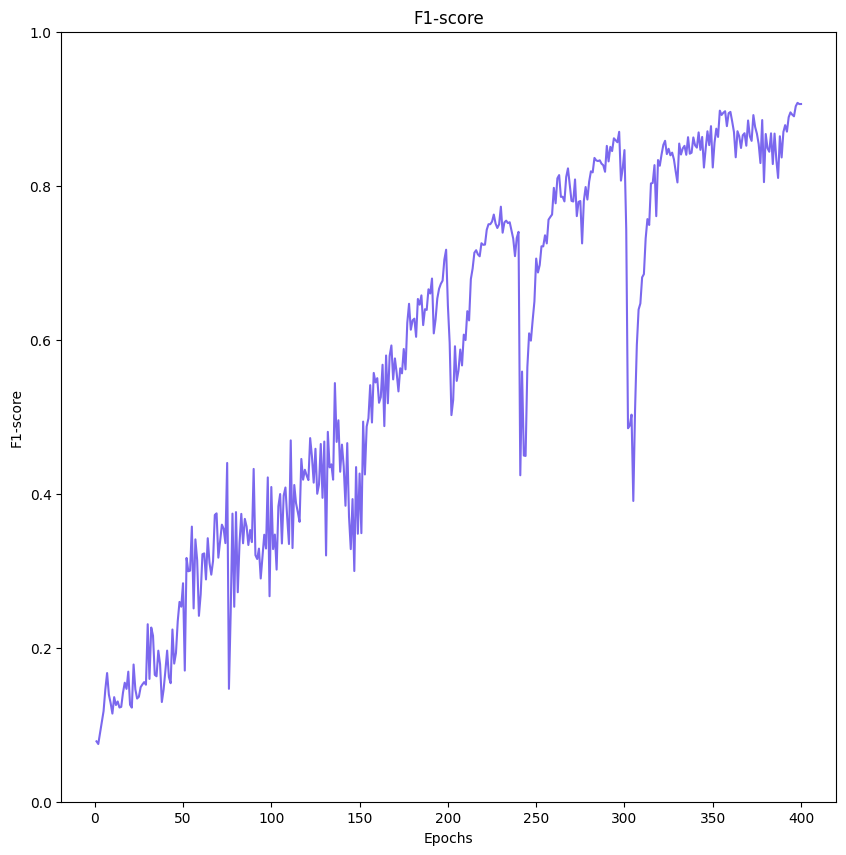
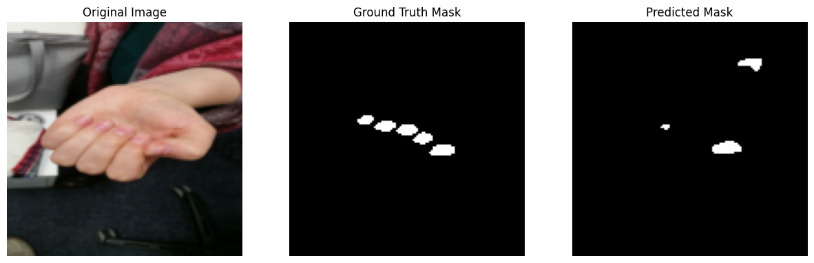
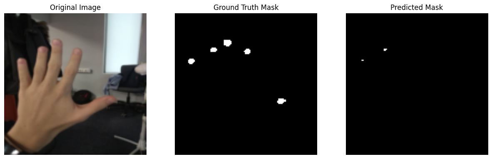
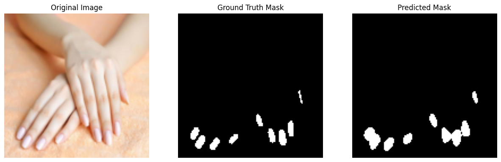

# nails_segmentation
Segmentation of nails pictures dataset released by Victor Papenko

## Проект по сегментации изображений ногтей с помощью самописной модели UNet на PyTorch

Загрузка датасета "vpapenko/nails-segmentation" происходит через Kaggle Hub. Датасет содержит 52 изображения.

Пример изображения и его маски:


## Содержание
1. [Требования](#требования)
2. [Использование](#использование)
3. [Структура проекта](#структура-проекта)
4. [Метрики](#метрики)
5. [Результаты](#результаты)

## Требования
- Python 3.10
- Зависимости:
  ```bash
  torch==2.0.1
  torchvision==0.15.2
  numpy==1.23.5
  scikit-learn==1.2.2
  matplotlib==3.7.1
  Pillow==9.5.0
  pyyaml==6.0.1
  kagglehub==0.3.6
  ```

## Использование
1. Клонируйте репозиторий:
```bash
git clone https://github.com/Guiuii/nails-segmentation.git
cd nails-segmentation
```
2. Установите зависимости:
```bash
   pip install -r requirements.txt
```
3. Запустите основной скрипт:
```bash
   python main.py
```
4. Результаты:
   - Метрики для каждой эпохивыводятся в консоль
   - Графики зависимости Loss и F1-score от количества эпох сохраняются в `plots`
   - Картинки с визуализацией сегментации тестовых изображений сохраняются в `results`

## Структура проекта
```
.
├── main.py
├── config.yaml
├── requirements.txt
├── create_dataset.py
├── unet.py
├── compute_class_weights.py
├── elasticnet_loss.py
├── train.py
├── test.py
├── plot_metrics.py
├── plots
│   ├── F1-score_per_epoch.png
│   └── Loss_per_epoch.png
├── results
│   ├── segmentation_pic_0.png
│   ├── segmentation_pic_10.png
│   ├── segmentation_pic_1.png
│   ├── segmentation_pic_2.png
│   ├── segmentation_pic_3.png
│   ├── segmentation_pic_5.png
│   ├── segmentation_pic_6.png
│   ├── segmentation_pic_7.png
│   ├── segmentation_pic_8.png
│   └── segmentation_pic_9.png
├── Nails_notebook.ipynb
├── u-net-architecture.png
└── example_of_pic.png
```

## Метркии

- Графиков зависимости Loss от количества эпох:
  


- Графиков зависимости F1-score от количества эпох:
  


## Результаты

- Визуализация сегментации ногтей на тестовых изображениях:










